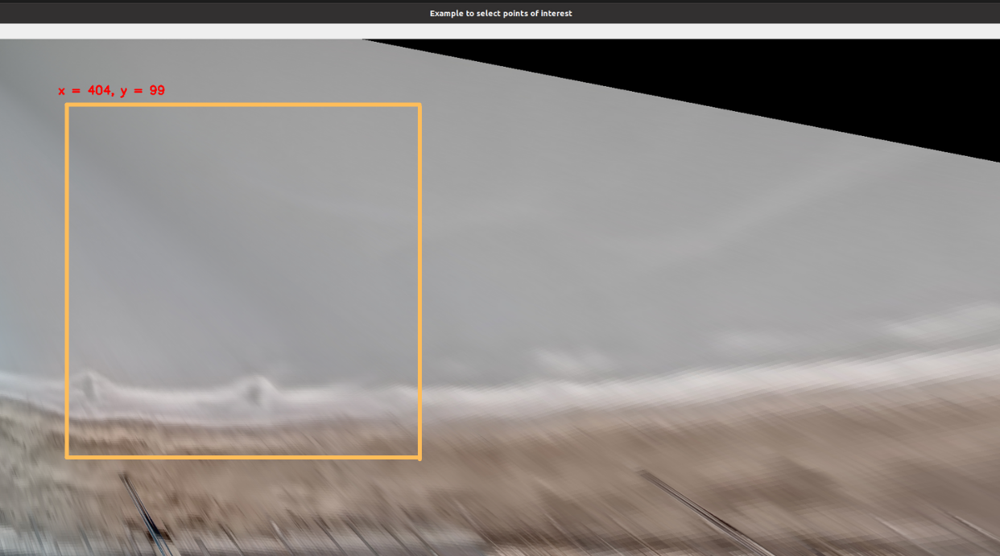

# Sand bar detection using average images

This code allow to identify the presence of sand bar using a convolutional neural network proposed by [Ellenson et al. (2021)](https://github.com/anellenson/DeepBeachState) and average images. The original CNN allows to identify five different types of beach state, but the objective of this repository is only to detect the existence of sand bar and not its shape, then the last layer of CNN was modified. The last layer was reduced from five neurons (five types of beach state) to one neuron where 1 corresponds to the presence of sand bar and 0 other case.

The model checkpoints are available at [Google Drive Folder](https://drive.google.com/drive/folders/1w_kOFx7su7BONQdwQQwx9_V-4pj2-bAY?usp=sharing). It's necessary to download files and put on model folder.


## Inputs and parameters
**Parameters**
```
all_inputs = {
    "beach_folder": "Portlanouvelle",          # This folder contains all images and results
    "image_folder": "frames",                  # Folder with all images to use
    "results_folder": "sandbar_results"        # Folder to save results
}
```
**Note**: the main path is the folder where the repository is cloned and the code uses `os.getcwd()` to get main path by default.

**Inputs**

The algorithm uses average images of a beach of interest (see figure 1). The image size does not matter but to get a prediction is necessary to select a square part of original image 512x512 in size due to network requirements. An interactive algorithm is used to identify the top left coordinate of that square image.

<p align="center">
  
</p>
<p align="center">
    <em>Figure 1: Example of the identification of the coordinates of square part on original image.</em>
</p>

**Folders**
```
sandbar_detection_using_average_images
    ├─── beach_path
         ├─── frames
              ├─── P_00000.png
              ├─── ...
              ├─── P_N.png
         ├─── results
    ├─── model
         ├─── best_1.h5
         ├─── model_1.json
    ├─── sandbar_functions.py
    ├─── additional_functions.py
    ├─── main.py
    ├─── requirements.py
    ├─── all_inputs.py
```    

## Implementation
The algorithm uses tensorflow packages then it's necessary to create a new virtual environment. All packages are in `requirements.txt`. The algorithm uses python 3.7.

#### Install Python 3.7
1. `sudo add-apt-repository ppa:deadsnakes/ppa`
2. `sudo apt-get update`
3. `sudo apt-get install python3.7`

#### Create virtual environment and clone respository
1. `virtualenv -p python3.7 <my_env_name>`
2. `source <my_env_name>/bin/activate`
3. `cd ./Desktop/`
4. `git clone https://github.com/fj23eslaonda/sandbar_detection_using_average_images.git`

#### Activate virtual environment, change directory and run algorithm
1. `cd ./sandbar_detection_using_average_images`
2. `pip install -r requirements.txt`
3. Create **folders** with datasets
4. `python3 run_prediction.py --parameters ./all_inputs.json --number_img 50`

## Comments
- `main_path` by default is the folder where the repository is cloned using `os.getcwd()`

